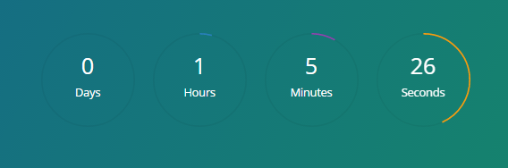

# Angular circle countdown
Circle countdown for angular



## See All demos
[Demo & Examples](http://shakogegia.github.io/angular-circle-countdown/)

## Install 
with bower
```
$ bower install angular-circle-countdown --save
```

## Include
Include dependecies at first
```html
<script src="bower_components/jquery-knob/dist/jquery.knob.min.js"></script>
<script src="bower_components/jquery-throttle-debounce/jquery.ba-throttle-debounce.js"></script>
<script src="bower_components/moment/min/moment-with-locales.min.js"></script>
```

include files
```html
<link rel="stylesheet" href="bower_components/angular-circle-countdown/dist/angular_circle_countdown.css">
<script src="bower_components/angular-circle-countdown/dist/angular_circle_countdown.js"></script>
```

### Usage

Inlucde in your app

```js
var app = angular.module('App', ['circle.countdown']);

app.controller('AppController', ['$scope', function($scope){
  
    $scope.finished = function(){
        // Finish callback
    };
    
}])
```

Insert in your html

```html
<countdown time="100" colors="flat-colors" finish-callback="finished()"></countdown>
```

Or to use a specific date:

```html
<countdown date="'2017-10-01 10:00 +0000'" colors="flat-colors" finish-callback="finished()"></countdown>
```

### Configuration

Choose your theme:
```
flat-colors, flat-colors-wide, flat-colors-very-wide, 
flat-colors-black, black, black-wide, black-very-wide, 
black-black, white, white-wide, 
white-very-wide or white-black
```

```time``` attribude - accepts seconds

```finish-callback``` attribude - function, assign callback function which will be called after timer finish